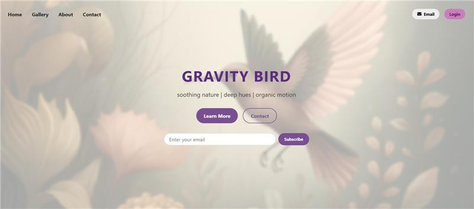

# Mail

_website design project_

## About

More practice in creating designs.

Site published at: https://aura-lem.github.io/gravity-bird/

Design: 

## Project features/goals

  - Github pages
  - no responsive design
  - inline CSS
  - FontAwesome icons
  - display: flex
  - favicon
  - hover state
  - bash commands:
    - `touch index.html` (sukuria faila)
    - `touch failas1.txt failas2.txt failas3.txt failas4.txt` 
    - `mkdir img` (sukuria folderi/direktorija)
    - `mkdir folder1 folder2 folder3 folder14` 
    - `ls -al` (stulpeliu atvaizduoja direktorijoje esanti turini)
    - `rm failo.pavadinimas` (pasalina faila)
  - git commands:
    - `git init` (git repozitorijos inicijavimas)
    - `git add .` (visus paredaguotus failus perkelia i "stage", t.y. paruosia commit'inimui)
    - `git commit -m "Mesage text` (su'commit'ina)
    - `git push` (issiuncia commit'a i remove repozitorija (Github))


## Getting Started

### Prerequisites

Node.js - _download and install_

```
https://nodejs.org
```

Git - _download and install_

```
https://git-scm.com
```

### Run locally

Would like to run this project locally? Open terminal and follow these steps:

1. Clone the repo
    ```sh
    git clone https://github.com/Aura-Lem/gravity-bird.git
    ```
2. Install NPM packages
    ```sh
    npm i
    ```
    or
    ```sh
    npm install
    ```
3. Run the server
    ```sh
    npm run dev
    ```

### Running tests

There is no tests for this project.

## Authors 

Aurelija: [Github](https://github.com/Aura-Lem)